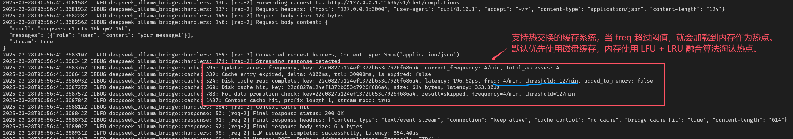
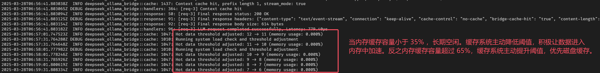

<div align="center">
    <h1>DeepSeek-Ollama Bridge</h1>
    <h3> 🚀 让你的 AI 对话更快、更稳、更省心！</h3>
	
</div>

## 😫 你是否遇到过这些烦恼？

-   大语言模型本地部署后重复计算相同问题，算力资源严重浪费
-   高并发场景下系统不稳定，响应延迟大幅波动
-   模型输出夹杂思考标签，影响对话体验
-   服务器资源告急，性能调优无从下手

## 🎯 解决方案来了！

DeepSeek-Ollama Bridge 是一款面向多模型场景的高性能代理服务，全面支持 DeepSeek、QWen、GPT4o、Gemini、Claude 等主流大语言模型，助力 AI 应用性能提升。

本服务基于 OpenAI API 规范构建，集成高效缓存系统，提供共享 API Key 设置功能，支持 LuaJIT 运行时环境，并可通过自定义 Lua 脚本实现功能扩展。在安全性、性能表现及易用性等方面，为 AI 应用提供全方位优化支持。

### 🎁 核心特性

#### 1️ 智能多层缓存系统

-   高性能内存热点缓存（8192 条），极速响应
-   磁盘持久化存储，不受内存大小限制，支持百万级缓存
-   对话上下文感知，智能匹配历史应答
-   自动化清理机制，无需人工维护
-   灵活的缓存参数配置，轻松应对各类场景
-   注意：流式输出模式（stream=true）从 v0.1.15 版本开始支持

#### 2️ 成熟的流量控制

-   令牌桶限流保护，防止系统过载
-   Prometheus 指标监控，运行状态一目了然

#### 3️ 容器部署支持

-   支持 Kubernetes 集群部署
-   优雅启停机制
-   跨平台兼容性支持
-   完整的监控指标

#### 4️ 智能思考标签过滤

-   支持 DeepSeek、QWen、LLAMA 等主流模型的思考标签过滤系统
-   自动识别并移除模型输出中的思考过程标记
-   保持输出内容的专业性和连贯性
-   零延迟处理，不影响模型响应速度

#### 5️ 企业级共享模式（从 v0.1.15 版本开始）

-   API Key 集中托管与管理

#### 6️ LuaJIT 运行时支持（从 v0.1.16 版本开始）

-   内置高性能 LuaJIT 运行时环境
-   支持自定义 Lua 脚本扩展系统功能
-   毫秒级响应，适用于实时处理场景

#### 7️ 异步请求支持（从 v0.1.16 版本开始）

-   支持异步请求处理，提升系统吞吐量
-   请求对象需包含 `request_fingerprint` 字段，用于结果提取
-   自动重试机制，确保请求可靠性
-   幂等性支持，防止重复处理
-   结果缓存机制，提升后续请求响应速度

### 💪 为什么选择 DeepSeek-Ollama Bridge ？

-   支持 DeepSeek、QWen、GPT4o、Gemini、Claude 等主流大语言模型
-   开箱即用，可以零配置启动
-   显著提升响应速度，降低计算成本
-   自动过滤思考标签（专门针对 DeepSeek 蒸馏模型），输出更清晰专业

### 🎬 典型应用场景

#### 1️ 高频对话场景

-   智能客服系统
-   教育问答平台
-   API 集成服务

#### 2️ 资源受限环境

-   个人开发环境
-   边缘计算设备
-   共享计算集群

#### 3️ 企业级应用

-   大规模 AI 服务部署
-   多租户并发访问
-   成本敏感型业务
-   Key 托管

### 📚 支持文档

可以阅读 `docs` 目录下的文档，了解 DeepSeek-Ollama Bridge 的详细使用方法。

### 📁 实用方案

可以阅读 `practical_schemes` 目录下的文档，了解 DeepSeek-Ollama Bridge 的实用方案。

### 📝 版本更新

可以阅读 `CHANGLOG.md` 文件，了解 DeepSeek-Ollama Bridge 的版本更新历史。

### 🤖 默认接口

-   **/health** : 健康检查接口
-   **/metrics** : Prometheus 指标监控接口

### 📊 效果展示

#### 1. 缓存效果 (stream=false)


#### 2. 缓存效果 (stream=true)


#### 3. 流量控制


#### 4. 企业级共享模式


#### 5. LuaJIT 运行时


#### 6. 请求后端服务 Retry


#### 7. 异步请求

请求对象结构体中需包含 `request_fingerprint` 字段，该字段将作为后续提取异步结果的唯一标识。在异步结果未返回前，系统将返回 HTTP 202 (Accepted) 状态码。

v0.1.16-rc7 之后版本使用 HTTP 202 (Accepted) 状态码，之前使用 HTTP 469 状态码。


#### 8. 异步请求（幂等性）

在异步结果未返回前，若发起相同内容的请求，系统将触发幂等性机制，并返回 HTTP 202 (Accepted) 状态码。

v0.1.16-rc7 之后版本使用 HTTP 202 (Accepted) 状态码，之前使用 HTTP 469 状态码。


#### 9. 热提升动态缓存（从 v0.1.16-rc9 版本开始）

热提升动态缓存系统能够智能感知请求热度，根据上下文的访问频率（访问频率越高，优先级越高）自动将磁盘缓存数据提升至内存中，显著提升响应速度和用户体验。

通过 `--cache-hot-threshold` 参数可灵活配置热提升阈值，默认值为 12。该参数以"每分钟请求次数"为单位，当某一上下文的访问频率超过设定阈值（如每分钟超过 12 次请求）时，系统将自动将相关缓存从磁盘提升至内存，实现高效访问。



通过 `--cache-hot-threshold` 设置的阈值只是一个初始阈值，系统会根据实际情况动态调整。



## 🎁 快速开始

只需一行命令，即可启动企业级 AI 加速服务：

```bash
deepseek-ollama-bridge --enable-cache --cache-dir ./cache
```

更多高级配置选项请使用 `-h` 参数查看帮助文档。

**命令行参数（从 v0.1.16 版本开始）**

```bash
选项:
  -d, --debug
          启用详细调试日志，用于追踪请求/响应和系统诊断
  -l, --listen <LISTEN>
          桥接服务监听的网络地址和端口 (格式: 主机:端口) [默认: 127.0.0.1:3000]
  -o, --ollama <OLLAMA>
          Ollama API 端点的基本 URL，用于请求转发 (格式: http(s)://主机:端口) [默认: http://127.0.0.1:11434]
  -t, --timeout <TIMEOUT>
          每个 HTTP 请求的全局超时时间（毫秒），包括连接和响应时间 (范围: 1000-86400000) [默认: 300000]
  -r, --rate-limit <RATE_LIMIT>
          Ollama API 调用的每秒最大并发请求数，0 表示无限制 (范围: 0-65535) [默认: 0]
  -a, --retry-attempts <RETRY_ATTEMPTS>
          Ollama API 请求失败后的最大重试次数，0 表示不重试 (范围: 0-1024) [默认: 0]
  -i, --retry-min-interval <RETRY_MIN_INTERVAL>
          Ollama API 请求失败后的初始重试等待时间（毫秒），按指数增长 (范围: 50-300000) [默认: 500]
  -m, --retry-max-interval <RETRY_MAX_INTERVAL>
          Ollama API 请求失败后的最大重试等待时间（毫秒），限制指数回退 (范围: 50-300000) [默认: 10000]
      --disable-think-filter
          禁用从模型响应中移除 <think>...</think> 标签的功能
      --enable-async-request
          启用异步请求模式，请求立即返回，处理在后台继续
      --enable-cache
          启用持久化磁盘缓存，用于相同的 LLM 请求以提高响应速度
      --cache-dir <CACHE_DIR>
          存储持久化缓存数据的目录路径 (格式: 路径/到/缓存) [默认: ./cache]
      --cache-ttl <CACHE_TTL>
          缓存响应过期并被移除的时间（毫秒） (范围: 30000-86400000) [默认: 30000]
      --cache-max-entries <CACHE_MAX_ENTRIES>
          缓存中的最大条目数，达到限制时移除最旧的条目 (范围: 4500-1000000) [默认: 65535]
      --enable-shared-mode
          启用单一 API 密钥模式，覆盖单个客户端身份验证
      --api-key <API_KEY>
          共享模式启用时用于所有请求的全局 API 密钥
      --enable-luajit
          启用 LuaJIT 运行时，用于自定义请求/响应处理
      --luajit-instances-power <LUAJIT_INSTANCES_POWER>
          LuaJIT 线程池大小的 2 的幂次方，例如 3 表示 2^3=8 个线程 (范围: 1-8) [默认: 1]
      --luajit-script <LUAJIT_SCRIPT>
          自定义处理的 Lua 脚本文件路径 (启用 LuaJIT 时必需) [默认: ./plugin.lua]
      --luajit-package-path <LUAJIT_PACKAGE_PATH>
          自定义 Lua 模块搜索路径 (格式: './lua/?.lua;./lua/?/init.lua')
      --luajit-package-cpath <LUAJIT_PACKAGE_CPATH>
          自定义 Lua C 模块搜索路径 (格式: './lua/?.so;./lua/loadall.so')
  -h, --help
          打印帮助信息
  -V, --version
          打印版本信息
```

_注：实际性能提升因使用场景和配置而异。欢迎留言反馈问题和改进建议。_

## 📦 中间件

从 **v0.1.16** 版本开始，支持 LuaJIT 运行时，支持自定义 Lua 脚本扩展系统功能。

-   **HandleServerRequest 函数**：处理客户端发送的请求
-   **HandleServerResponse 函数**：处理服务端返回的响应

> [!NOTE]
>
> 下面提供一个示例，其中 `function HandleServerRequest(request)` 和 `function HandleServerResponse(response)` 函数是必须实现的。要不然会报错，如果没有逻辑可以编写一个空函数。

### plugin.lua 代码示例

```lua
-- 处理请求
-- @param request table 请求对象
--   - request.path string 请求路径 (例如: "/api/users")
--   - request.method string 请求方法 (例如: "GET", "POST")
--   - request.headers table 请求头
--     - 键为小写的header名称 (例如: "content-type", "authorization")
--     - 值为对应的header值
--   - request.body string 请求体内容
-- @return boolean, table 返回两个值:
--   1. boolean:
--      - true: 继续处理请求
--      - false: 拦截请求，返回自定义响应
--   2. table:
--      当第一个返回值为 true 时:
--        - 返回修改后的 request 表
--      当第一个返回值为 false 时:
--        - status_code number HTTP状态码
--        - body string 响应体
--        - headers table 响应头
function HandleServerRequest(request)

    -- 示例：记录请求
    print("Handling request to: " .. request.path)

    -- 示例：修改请求头
    request.headers["x-modified-by"] = "Lua-Middleware-Request"

    -- 示例：拦截特定请求
    if request.path == "/blocked" then
        return false, {
            status_code = 403,
            body = "Access denied by Lua middleware",
            headers = {
                ["content-type"] = "text/plain"
            }
        }
    end

    -- 继续处理请求
    return true, request
end

-- 处理响应
-- @param response table 响应对象
--   - response.status_code number HTTP状态码 (例如: 200, 404)
--   - response.headers table 响应头
--     - 键为小写的header名称 (例如: "content-type")
--     - 值为对应的header值
--   - response.body string 响应体内容
-- @return table 返回修改后的响应对象
--   - status_code number 修改后的HTTP状态码
--   - headers table 修改后的响应头
--   - body string 修改后的响应体内容
function HandleServerResponse(response)

    -- 示例：添加响应头
    response.headers["x-powered-by"] = "Lua-Middleware-Response"

    -- 调试日志：打印Content-Type
    print("Response Content-Type:", response.headers["content-type"])

    -- 示例：修改响应体
    if response.headers["content-type"] == "text/plain" then
        response.body = response.body .. "\n(Modified by Lua)"
    end

    -- 返回修改后的响应对象
    return response
end
```

### 支持第三方 lua 库和 dll 和 so 文件

-   支持挂载外部 lua 库
-   支持挂载外部 dll 文件
-   支持挂载外部 so 文件

```lua
-- plugin.lua - 主 Lua 脚本
-- 使用自定义模块处理请求和响应

-- 加载自定义模块
local cjson = require('cjson')
local utils = require("utils")

-- 调试模式
local DEBUG = true

-- 处理服务器请求的函数
-- 返回值：
-- 1. 布尔值，表示是否继续处理请求（true 表示继续，false 表示拦截）
-- 2. 请求表，如果拦截请求，可以包含自定义响应
function HandleServerRequest(request)
    local jsonData = {
        name = "Alice",
        age = 30,
        address = {
            city = "Shanghai",
            zip = "200000"
        },
        hobbies = {"reading", "traveling", "coding"},
        isStudent = false
    }

    local jsonBody = cjson.encode(jsonData)

    print(jsonBody)

    -- 继续处理请求
    return true, request
end

-- 处理服务器响应的函数
-- 返回值：修改后的响应表
function HandleServerResponse(response)
    return response
end
```

## 💡 访问代码示例

### cURL 示例

```bash
curl http://127.0.0.1:3000/v1/chat/completions \
  -H "Content-Type: application/json" \
  -H "Authorization: Bearer sk-xxx" \
  -d '{
    "model": "deepseek-coder",
    "messages": [
      {
        "role": "user",
        "content": "写一个冒泡排序算法"
      }
    ],
    "temperature": 0.7
  }'
```

### Python 示例

```python
import openai

# 设置 API 基础地址（默认为本地服务）
openai.api_base = "http://127.0.0.1:3000/v1/chat/completions"
# 设置一个占位 API Key（本地服务不校验）
openai.api_key = "sk-xxx"

# 基础对话示例
def chat_example():
    response = openai.ChatCompletion.create(
        model="deepseek-coder",  # 使用 DeepSeek Coder 模型
        messages=[
            {"role": "user", "content": "写一个 Python 快速排序算法"}
        ],
        temperature=0.7
    )
    print(response.choices[0].message.content)

# 带上下文的对话示例
def context_chat_example():
    messages = [
        {"role": "system", "content": "你是一个专业的编程助手。"},
        {"role": "user", "content": "我想实现一个 REST API。"},
        {"role": "assistant", "content": "我可以帮你使用 FastAPI 框架实现。"},
        {"role": "user", "content": "好的，请给出具体示例。"}
    ]

    response = openai.ChatCompletion.create(
        model="deepseek-coder",
        messages=messages,
        temperature=0.7
    )

    print(response.choices[0].message.content)

if __name__ == "__main__":
    print("基础对话示例：")
    chat_example()

    print("\n带上下文的对话示例：")
    context_chat_example()
```

### Go 示例

```go
package main

import (
    "context"
    "fmt"
    "log"

    openai "github.com/sashabaranov/go-openai"
)

func main() {
    // 创建客户端（使用本地服务地址）
    client := openai.NewClient("sk-xxx")
    client.BaseURL = "http://127.0.0.1:3000/v1/chat/completions"

    // 创建对话请求
    req := openai.ChatCompletionRequest{
        Model: "deepseek-coder",
        Messages: []openai.ChatCompletionMessage{
            {
                Role:    openai.ChatMessageRoleUser,
                Content: "用 Go 实现一个简单的 HTTP 服务器",
            },
        },
        Temperature: 0.7,
    }

    // 发送请求
    resp, err := client.CreateChatCompletion(context.Background(), req)
    if err != nil {
        log.Printf("对话请求失败: %v\n", err)
        return
    }

    // 输出响应
    fmt.Println(resp.Choices[0].Message.Content)

    // 带上下文的对话示例
    contextReq := openai.ChatCompletionRequest{
        Model: "deepseek-coder",
        Messages: []openai.ChatCompletionMessage{
            {
                Role:    openai.ChatMessageRoleSystem,
                Content: "你是一个专业的 Go 开发专家。",
            },
            {
                Role:    openai.ChatMessageRoleUser,
                Content: "解释什么是依赖注入",
            },
        },
        Temperature: 0.7,
    }

    contextResp, err := client.CreateChatCompletion(context.Background(), contextReq)
    if err != nil {
        log.Printf("上下文对话请求失败: %v\n", err)
        return
    }

    fmt.Println("\n带上下文的对话响应:")
    fmt.Println(contextResp.Choices[0].Message.Content)
}
```

### NodeJS 示例

```javascript
const { Configuration, OpenAIApi } = require("openai");

// 配置 OpenAI API
const configuration = new Configuration({
    basePath: "http://127.0.0.1:3000/v1/chat/completions",
    apiKey: "sk-xxx",
});

const openai = new OpenAIApi(configuration);

// 基础对话示例
async function basicChatExample() {
    try {
        const response = await openai.createChatCompletion({
            model: "deepseek-coder",
            messages: [{ role: "user", content: "用 Express 实现一个 RESTful API" }],
            temperature: 0.7,
        });

        console.log("基础对话响应:", response.data.choices[0].message.content);
    } catch (error) {
        console.error("对话请求失败:", error.message);
    }
}

// 带上下文的对话示例
async function contextChatExample() {
    try {
        const response = await openai.createChatCompletion({
            model: "deepseek-coder",
            messages: [
                { role: "system", content: "你是一个专业的 Node.js 开发专家。" },
                { role: "user", content: "如何实现一个 WebSocket 服务器？" },
            ],
            temperature: 0.7,
        });

        console.log("\n带上下文的对话响应:");
        console.log(response.data.choices[0].message.content);
    } catch (error) {
        console.error("对话请求失败:", error.message);
    }
}

// 执行示例
async function main() {
    console.log("=== 基础对话示例 ===");
    await basicChatExample();

    console.log("\n=== 带上下文的对话示例 ===");
    await contextChatExample();
}

main().catch(console.error);
```
